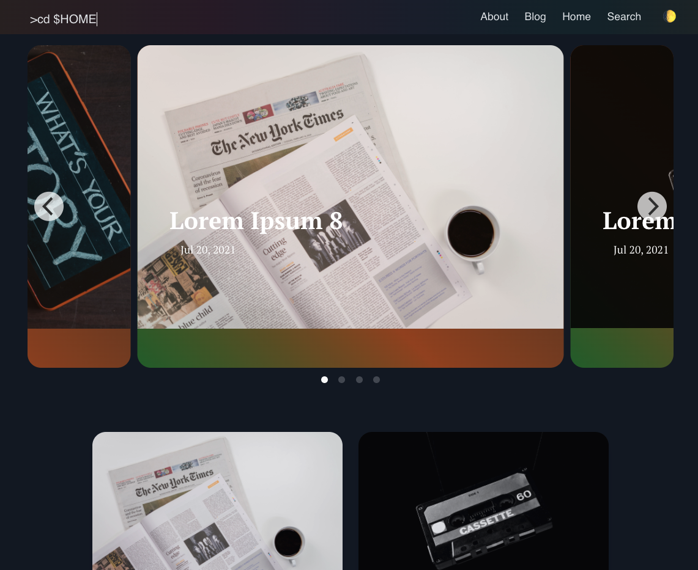

# Memoir Theme for Hugo

Memoir is a theme for the [Hugo](https://gohugo.io) with [Bulma CSS](https://bulma.io).

## Getting Started

Create a new site with Hugo

```bash
hugo new site hugo-example-site
cd hugo-example-site
git init
```

Now you can add the theme

```bash
git submodule add https://github.com/tthseus/memoir-theme.git themes/memoir-theme
```

Copy `config.toml` and `exampleSite\content`; Customizing your page.  


```bash
hugo --gc --minify
or 
hugo server -D
```

# Credits

-   [Starter theme by @dirkolbrich](https://github.com/dirkolbrich/hugo-theme-tailwindcss-starter)
-   [Academic theme by @gcushen](https://sourcethemes.com/academic/)